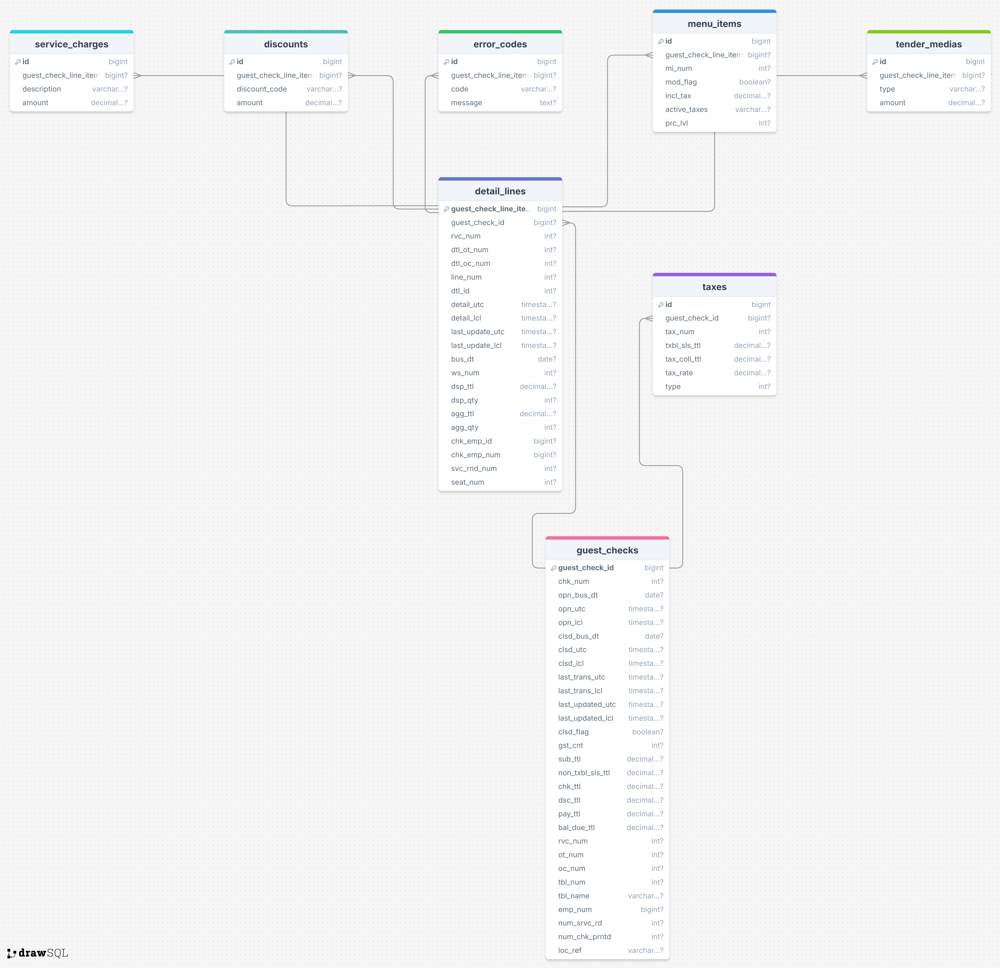

# Desafio Engenheiro de Dados - Coco Bambu 2025

## Visão Geral
Este projeto tem como objetivo apresentar a solução para o desafio técnico proposto pelo Coco Bambu para a vaga de Engenheiro de Dados. Ele envolve a modelagem de um JSON de um sistema ERP de restaurante, a transcrição para banco de dados relacional, e a estruturação de um data lake para ingestão de dados recebidos de múltiplas APIs.

---

## 1. Modelagem SQL
A modelagem foi feita com base no princípio da normalização e facilidade de expansão futura, pensando em cenários com múltiplos tipos de `detailLines` (menuItem, discount, serviceCharge etc). Veja a estrutura em `sql/tables.sql`.

Principais tabelas:
- `guest_checks`
- `taxes`
- `detail_lines`
- `menu_items`

---

## 2. Script ETL
O script `etl/parse_erp_json.py` lê o JSON de exemplo e extrai os dados para popular as tabelas relacionais. O script é modular e pode ser adaptado para uma pipeline real.

### Exemplo de saída (prints para debug):
```python
{'guest_check': {...}}
{'tax': {...}}
{'detail_line': {...}}
{'menu_item': {...}}
```

---

## 3. Estrutura do Data Lake

### Por que armazenar as respostas das APIs?
- **Auditoria:** mantém um histórico confiável de todos os dados recebidos.
- **Reprocessamento:** possibilita reexecutar transformações se necessário.
- **Rastreamento:** facilita identificar inconsistências em análises.
- **Desacoplamento:** separa a coleta de dados do processamento.
- **Versionamento:** adapta pipelines a mudanças de schema sem perda de dados.

```
/data-lake/
  /raw/
    /getGuestChecks/
      /store_id=99_CB_CB/
        /bus_dt=2024-01-01/
          guest_checks.json
    /getFiscalInvoice/
      /store_id=99_CB_CB/
        /bus_dt=2024-01-01/
          fiscal_invoice.json
    /getChargeBack/
    /getTransactions/
    /getCashManagementDetails/
```
Essa estrutura facilita consultas e reprocessamento.

---

## 4. Mudanças no Schema da API
Caso ocorram alterações no schema (ex: `taxes` → `taxation`), a ingestão deve incluir:
- Validação de schema via JSON Schema.
- Transformações padronizadas antes da carga no DW.
- Controle de versão de schema.
- Armazenar sempre o JSON original para rastreabilidade
---

## 5. Como Executar
1. Clonar o repositório
2. Executar o SQL em `sql/tables.sql` no banco de dados.
3. Executar o script ETL:
```bash
python etl/parse_erp_json.py
```

---

## 6. Tecnologias Utilizadas
- Python
- PostgreSQL
- JSON / JSON Schema
- Estrutura de Data Lake

---

## Autor
Rodrigo Bianchini

---

## Licença
Este projeto foi desenvolvido exclusivamente para o processo seletivo do Coco Bambu 2025.

---

### Diagrama ER

Veja abaixo o diagrama de modelagem relacional utilizado neste projeto:

